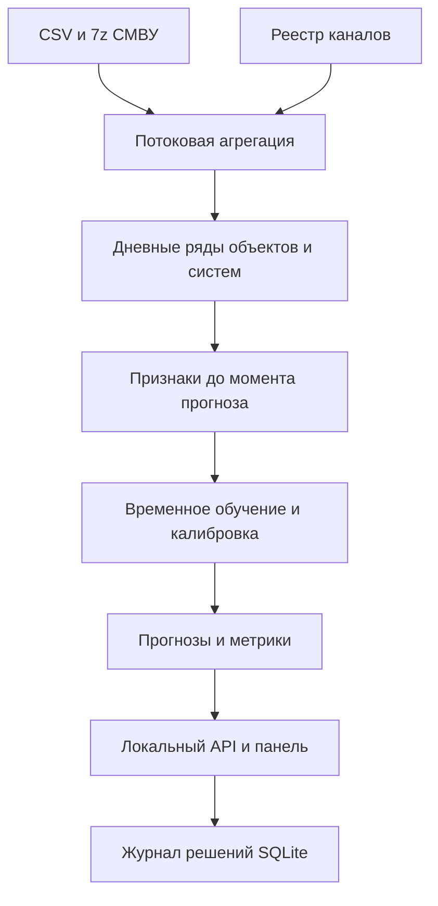

# Коллектор: прогноз срабатываний и рабочее место диспетчера

Ссылка на прототип: https://forecasting-nastyast.amvera.io/
Ссылка на демо видео: https://drive.google.com/file/d/1-JlUvf5YYmVu-wqz4YhvTpU5_A3gGGgA/view?usp=sharing

Прототип для задачи «Сервис прогнозирования инцидентов и управления ремонтными работами инженерных коллекторов Москвы» (ЛЦТ 2026). Выход модели - **вероятность нового тревожного срабатывания по объекту и системе в следующий календарный день**. Это наблюдаемый в предоставленных данных суррогат риска, **не вероятность подтвержденного пожара, подтопления или отказа**. Окончательное решение принимает диспетчер.

## Быстрый запуск

**Открыть интерфейс:** запустите сервер по инструкции ниже и перейдите на `http://127.0.0.1:8080`. Войдите как `dispatcher` или `admin` с паролем `demo`. Роль диспетчера создана по умолчанию; другие роли и учетные записи администратор добавляет на странице «Роли и доступ». Все новые страницы работают через Python сервер.

```bash
python -m venv .venv
source .venv/bin/activate
pip install -r requirements.txt
python -m collector_risk.server --artifacts artifacts --objects upload/справочник_объектов_диспетчер.csv
# http://127.0.0.1:8080
```

Запуск выполняется из корня распакованного проекта. В поставку входят готовые исторические `forecast.csv`, `daily.csv`, модель и метрики для демонстрации без архивов. Чтобы пересчитать их из исходных данных, поместите архивы и справочники в `upload` и отдельно запустите `python -m collector_risk.pipeline --input upload --output artifacts --years 2025 2026 --cutoff 2026-09-26`, затем `python -m collector_risk.model --daily artifacts/daily.csv --output artifacts`. Архивы не входят в поставку кода. Для 7z нужен `libarchive.so.13` (Debian/Ubuntu: `libarchive13`). В PyCharm запускайте модуль `collector_risk.server` с рабочей папкой в корне проекта.

**Дата отсечения:** `--cutoff` ограничивает доступные на момент прогноза записи. Демо использует 26.09.2026, но предоставленный архив 2026 года заканчивается **30.06.2026**; тест заканчивается 29.06.2026, так как для метки нужен следующий день. Интерфейс явно показывает историческую дату и не представляет эти данные как текущую обстановку. Отдельный пример журнала за 01.08.2026 не заполняет отсутствующий июльский ряд и не превращается в полноценный актуальный прогноз. В рабочей интеграции задавайте отсечение по фактическому watermark входного потока. Переобучение: запустите подготовку и обучение заново после поступления подтвержденных данных; прошлую тестовую выборку сохраняйте неизменной для сопоставимости.

## Компоненты и поток



- `archive.py`: читает CSV из 7z через `libarchive` ограниченными порциями, без распаковки на диск.
- `pipeline.py`: валидирует дату и ID канала, соединяет со справочником по точному ID, считает дневные сигналы, объем наблюдений, числовые сводки. Повторные строки заголовка в некоторых архивах исключаются. Неизвестные каналы учитываются в `data_quality.json` и не получают выдуманный объект.
- `model.py`: строит скользящие признаки 3/7/30 календарных дней, покрытие, сезонность, интенсивность и одновременные сигналы других систем объекта. Цель: срабатывание завтра после дня без сигнала. Ансамбль двух `HistGradientBoostingClassifier` (веса 0,75 и 0,25) обучается на прошлом; второй использует контекст других систем и ID известного объекта. Калибровка и порог устанавливаются на майской валидации. Прогноз без достаточного покрытия помечается отдельно. ID объекта как признак требует новой проверки при переносе на другие объекты.
- `server.py` и `web/`: локальный REST API, страницы, фильтры, карточка, действия диспетчера. `service.py` хранит решения, дерево, уведомления, заявки и аудит; `reports.py` формирует PDF/XLSX; `operations.py` и `scheduler.py` отвечают за контроль обновлений. Каналы источника используются только на чтение.

### Смысл вероятности

Для каждой пары объект/система и даты `t` вход доступен до конца суток `t`; метка указывает, возникал ли хотя бы один тревожный сигнал в сутки `t+1`, если в `t` сигналов не было и обе даты наблюдались. При ежедневном расчете в 23:59 это горизонт следующих 24 часов. Для более частого пересчета нужна отдельная часовая модель и проспективная проверка. Дни без записей **не** обозначаются отрицательными примерами. Приоритет «Активный сигнал» основан на наблюдаемом флаге и не зависит от модельного порога. Порог сырого ансамблевого балла выбирается на валидации по максимуму `min(precision, recall)`; выводимая вероятность изотонически калибруется отдельно. Дополнительные признаки `alarm_days_7obs` и `alarm_rate_30obs` используют последние наблюдавшиеся дни, без будущих записей.

**Метрики:** average precision с частотой событий и простым базовым ориентиром, ROC AUC, Brier, precision/recall при выбранном пороге и срез по системам. Сравнивайте показатели только на отложенном интервале; прогнозы редких систем не считайте доказанной эффективностью по одной общей метрике. Числовые значения датчиков разных типов имеют разные единицы; текущая простая сводка не является физическим порогом аварии.

На приложенной выгрузке июньский тест содержит 2 155 объектодней и 249 новых тревожных дней: average precision **0,456** против **0,277** у простой базы «был сигнал за 7 дней»; precision **45,8%**, recall **50,6%**. На майской валидации оба показателя составляли **48,1%**. Порог дал 275 проверок в тесте (12,8% объектодней), что увеличивает нагрузку на диспетчера. Прежняя версия давала average precision 0,408, precision 45,5%, recall 36,5%. **Одновременно более 50% precision и recall не достигнуты**; округление не меняет этот вывод. Это метрики по сигналам. Для затопления в тесте лишь **один** положительный объектодень, для пожарной категории **семь**; их частная точность статистически не подтверждена. Поскольку варианты исследовались итеративно, требуется новая проспективная проверка на еще не виденных датах.

## Диспетчерский сценарий

1. В панели выбрать «Активный сигнал» для проверки текущего события либо «Проверить» для превентивного осмотра. Поиск и фильтр системы сокращают список.
2. В карточке видны вероятность, горизонт, покрытие и история сигналов, а также рекомендация **проверить** конкретные источники. До подтверждения нельзя трактовать вероятность как установленный факт.
3. Зафиксировать действие, оператора и основание. Запись сохраняется в журнале; решение «ложное срабатывание» — только результат ручной верификации, не автоматическая классификация.
4. Для ремонта сверить реальный ID оборудования с учетной системой и графиком ППР, затем создать заявку в существующей системе. Автоматическое создание заявок не включено: в приложенных графиках названия «Объект 1», «Объект 2» и т. п. не имеют надежного ключа к IDs каналов. Интерфейс не утверждает, что эти планы уже сопоставлены.

### REST API

| Метод | Путь | Назначение |
| --- | --- | --- |
| GET | `/health` | Проверка доступности и даты прогноза |
| GET | `/api/forecasts` | Список рисков, статусов, оснований и рекомендаций |
| GET | `/api/metrics` | Границы выборок и честная отложенная оценка |
| GET | `/api/decisions` | Последние 200 решений диспетчера |
| POST | `/api/decisions` | `object_id`, `category`, `decision`, `operator`, `reason`; возвращает ID записи |

Пример: `curl -H 'Content-Type: application/json' -d '{"object_id":20,"category":"fire","decision":"проверка","operator":"Диспетчер 1","reason":"Проверю соседние каналы"}' http://127.0.0.1:8080/api/decisions`. Пара должна присутствовать в текущем прогнозе. Поля решения проверяются на стороне сервера.

## Ограничения и развитие

- `тревожное=true` — сигнал системы; в наборах нет достоверных меток подтвержденных аварий, выездов, ложных тревог, дат ввода/отказа оборудования и факта выполнения ППР. Нельзя честно обучить и оценить отдельные модели пожара, подтопления, отказа и ложного выезда без этих меток. Категория `flood` использует только датчики затопления, `pump` отделена; рекомендованные проверки являются экспертными правилами.
- Справочник состояний противоречив и содержит состояния, не соответствующие указанному типу датчика, поэтому не используется как жесткая истина о происшествии. В реестре нет координат и адресов, а названия обезличены; географическое положение восстановить достоверно нельзя. Схема сближает элементы с общим родителем и упорядочивает участки внутри площадки по номеру ПК, если он указан. Стороны света и расстояния на схеме условны. Погодных рядов нет.
- Установить физические пороги по конкретным моделям датчиков, подключить подтвержденные заявки/отказы и ручную разметку, согласовать ключи планов работ, затем обучить причинно привязанные модели по типам риска. Проверить перенос на другие подразделения и проспективно измерить снижение выездов, пропуски и время реакции.
- Это **локальный прототип**. Демо-авторизация, роли, аудит, локальная копия БД и повтор потока добавлены, но в промышленном контуре по-прежнему нужны сервисный доступ к СМВУ/реестру, брокер с watermark и DLQ, PostgreSQL, внешний неизменяемый аудит, резервное копирование с шифрованием, роли через AD/LDAP, TLS, мониторинг сквозной задержки и нагрузочная приемка. Демо-сервер слушает `127.0.0.1`; известный пароль `demo` не предназначен для публикации.

## Состав зависимостей

Python, pandas, NumPy, scikit-learn, joblib, системная libarchive. Клиентская часть — HTML/CSS/vanilla JavaScript, без CDN и внешних запросов. Обязательные входы: CSV справочников каналов и объектов, журналы CSV или архивы 7z; необязательные графики ТО используются для анализа ограничений, без недостоверного join.

## Сценарии интерфейса

После входа боковое меню открывает «Прогнозы», «Поступление данных», «Схема», «Оборудование», «Отчеты». Стартуют две учетные записи: `dispatcher` и системный `admin`. Диспетчер видит прогнозы, схему, оборудование и отчеты, сохраняет решения и черновики заявок. Администратор имеет полный доступ, видит поступление данных и страницу управления ролями. Он может создать, например, роль аудитора с одним правом `reports:read` и назначить ее новому логину. Права проверяются сервером при каждом запросе; их отзыв действует для открытой сессии. На странице прогнозов фильтры объекта, системы, статуса, порога и поиска идут одной строкой над таблицей (на узком экране переносятся); сортировка начинается с активного сигнала. Смысл двух числовых столбцов раскрывается подсказкой по заголовку, а статусы — в легенде и подсказке на бейдже. Сводка по системам показывает число пар объект/система по состояниям. Отсутствие свежих данных — отдельный повод проверить связь или датчик, а не подтвержденная поломка.

Схема собирает элементы одного родителя в рамку площадки и упорядочивает участки по номеру ПК, когда он есть в названии. Расстояние и стороны света условны. Красный означает тревожный сигнал, оранжевый — прогноз выше порога, зеленый — наблюдение и серый — недостаток данных. Реестр имеет раскрываемое дерево и поиск каналов внутри выбранного объекта. Страница потока и ее API доступны только администратору; на странице приведена инструкция к воспроизведению. Карточка делит действие на два шага: решение для журнала диспетчера и независимый черновик заявки на работы с ручным подтверждением. Внешняя отправка отключена. `GET /api/tickets/{id}` возвращает **явную заглушку** внешнего статуса. Отметка о просмотре оповещения не означает завершенный ремонт.

Пять видов отчетов — управленческий, прогнозы, оповещения и решения, качество данных, журнал действий. Доступны фильтры по периоду, объекту, системе, статусу и порогу там, где они применимы, а также PDF и XLSX из того же набора строк. В Excel два листа: данные и параметры с пояснениями. Показатели исторического `metrics.json` отделены от локальных записей периода. Дополнительные команды и контракт интеграции — в `docs/ARCHITECTURE.md`; анализ графиков и недостающих фактических ремонтов — `docs/SOURCE_ASSESSMENT.md`; результаты сценарных проверок — `docs/UX_REVIEW.md`.

```bash
# Локальные измерения и восстановление
python -m collector_risk.operations benchmark --artifacts artifacts --object-id 20 --repeats 30
python -m collector_risk.operations backup --artifacts artifacts --destination backup-demo
python -m collector_risk.operations verify-backup --destination backup-demo

# Ежедневное обновление; требуется разместить новые архивы и справочники в upload
python -m collector_risk.scheduler --source upload --artifacts artifacts --utc-time 23:59 --once

# Смешанный нагрузочный тест запускайте только против копии artifacts
python -m collector_risk.load_test --users 20 --object-id 20 --category fire
```

Локальные замеры в `artifacts/local_inference_benchmark.json`, `local_load_test.json`, `local_stream_test.json` **не подтверждают SLA на целевом сервере**. Для нового поступления нужны реальные архивы; вложенные графики 2026 года содержат планы, а не факты ремонта. Если появятся подтвержденные метки, `scheduler` сохраняет их отдельно и не переименовывает модель тревог в модель аварий.

## Воспроизводимость

`data_quality.json` фиксирует объем, покрытие и даты; `daily.csv` содержит подготовленные дневные данные; `model.joblib` — модель с калибратором и порогом; `metrics.json` — границы и результат теста; `forecast.csv` — текущие прогнозы. Случайное зерно обучения 42. Проверки запускаются командой `python -m unittest discover -s tests -v`. Модель из `joblib` следует загружать только из доверенного источника.

Сравнение базовой модели, модели с контекстом и ExtraTrees на фиксированной майской валидации повторяется командой `python -m experiments.compare`; таблица результатов записывается в `artifacts/model_comparison.json`. Скрипт не использует июньскую метку при выборе варианта.
